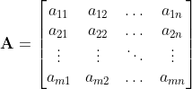
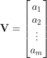
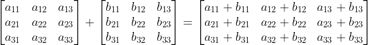
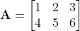
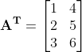
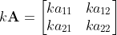

# **Introduction to Matrix Algebra**

## Introduction

A **matrix** is an ordered collection of numbers that facilities mathematical operations and is used in a number of fields in science, mathematics, and engineering. Common fields in which **matricies** (plural of matrix) and their applications are prevalent are: solving systems of linear equations in electrical, mechanical, and chemical engineering. In control and aerospace engineering, matricies are used to describe the state of a physical system and to study its motion in time and space. In data science, matricies are used to store and manipulate large sets of data. In game development, matricies are used to animate things that change on the players screen. There are of course many more applications but before we begin the study of a matrix, we will first define some terms.

## Matrix

A **matrix** (plural **matricies**) is simply a collection of numbers arranged in rectangular form. A matrix with *m* rows and *n* columns is called an *m-by-n matrix* and can be written as follows:  

Let's take a *2-by-2* matrix **A** as an example:

The number of rows and columns are also known as the **dimensions** of the matrix

A *1-by-n matrix* is called a **row vector**:

Similarly, an *m-by-1 matrix* is called a **column vector**:

A matrix where the number of rows equals the number of columns, an *n-by-n matrix*, is called a **square matrix**.

A *1-by-1 matrix* is known as a **scalar** and is simply written as a traditional number.

We will introduce more types of matricies as we need them later in this article.

## Matrix Operations

Now that we have introduced matricies, we will explore the types of operations we can perform on them.

Two matricies are considered **equal** if their corresponding elements are equal.

We can extend the idea of addition of numbers to matricies. Two matricies are added together by simply adding the elements of one matrix to the corresponding elements of another matrix.

Let's take the addition of matricies **A** and **B** as an example:  

  

It is important to note the following properties for matrix addition:

* Matrix addition is only possible if the dimensions of the matricies are the same. The addition of two matricies of different dimensions is undefined.
* Matrix addition is commutative: **A** + **B** = **B** + **A**
* Matrix addition is associative: (**A** + **B**) + **C** = **A** + (**B** + **C**)

Matrix subtraction works in the exact same way as matrix addition and is subject to the same properties with the exception that matrix subtraction is *NOT* commutative.

Matricies have a useful operation called a **transpose** in which an element located in row *i* and column *j* is placed at row *j* and column *i*. This operation inverts the dimensions of the matrix. The transpose operation is denoted by placing a **T** as a superscript on the original matrix.  

The transpose of matrix **A** is: 

  

There are two forms of matrix multiplication
* Multiplication by a scalar
* Multiplication by another matrix

In order to multiply matrix **A** by a scalar *k* (remember, a scalar is just a number) one simply multiplies each element of the matrix by the number *k*:

## Applications of Matricies: System of Linear Equations

In many fields of engineering, math, and science, linear equations are prevalent and important. As you remember from high school algebra class, a linear equation is presented in the form *ax + by = c*. Often it is necessary to obtain a solution to a *system of linear equations* which is more than one equation simultaneously. An example of this is:

>2x + 4y = 18  
4x - 2y = 16

As you learned in algebra class, this system of two linear equations can be solved by the elimination technique to yield a solution of *x = 5* and *y = 2*.  
In general, you can have a system of infintely many equations as long as you have as many equations as unknowns. Writing a system of equations as we have shown previously is fine for a small number of equations but will become awkward and hard to read as the number of equations increases. To solve this problem, we can write systems of equations compactly using a ***matrix***. To illustrate this, let's take the following system as an example:

>2x + 6y + z = 7  
x + 2y - z = -1  
5x + 7y - 4z = 9

This system of equations can be elegantly represented using a matrix:

 

We will show the how to use matricies to solve systems of equations later in this article after some properties and techniques are introduced.

This is also just one application of matrix.

