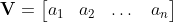

# **Introduction to Matrix Algebra**

## System of Linear Equations
---
In many fields of engineering, math, and science, linear equations are common and important. As you remember from high school algebra class, a linear equation is presented in the form *ax + by = c*. Often it is necessary to obtain a solution to a *system of linear equations* which is more than one equation simultaneously. An example of this is:

>2x + 4y = 18  
4x - 2y = 16

As you learned in algebra class, this system of two linear equations can be solved by the elimination technique to yield a solution of *x = 5* and *y = 2*.  
In general, you can have a system of infintely many equations as long as you have as many equations as unknowns. Writing a system of equations as we have shown previously is fine for a small number of equations but will become awkward and hard to read as the number of equations increases. To solve this problem, we can write systems of equations compactly using a ***matrix***. To illustrate this, let's take the following system as an example:

>2x + 6y + z = 7  
x + 2y - z = -1  
5x + 7y - 4z = 9

This system of equations can be elegantly represented using a matrix:

 

We will show the how to use matricies to solve systems of equations later in this article after some properties and techniques are introduced.

## Matrix
---
A **matrix** (plural **matricies**) is simply a collection of numbers arranged in rectangular form. A matrix with *m* rows and *n* columns is called an *m-by-n matrix* and can be written as follows:  

A *1-by-n matrix* is called a **row vector**:

Similarly, an *m-by-1 matrix* is called a **column vector**:

